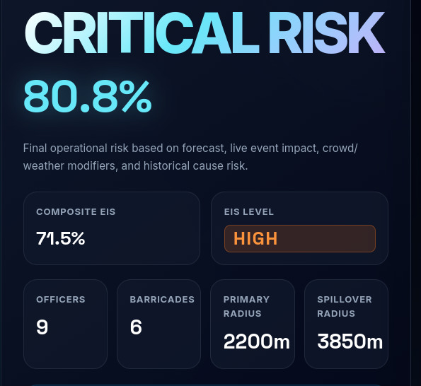
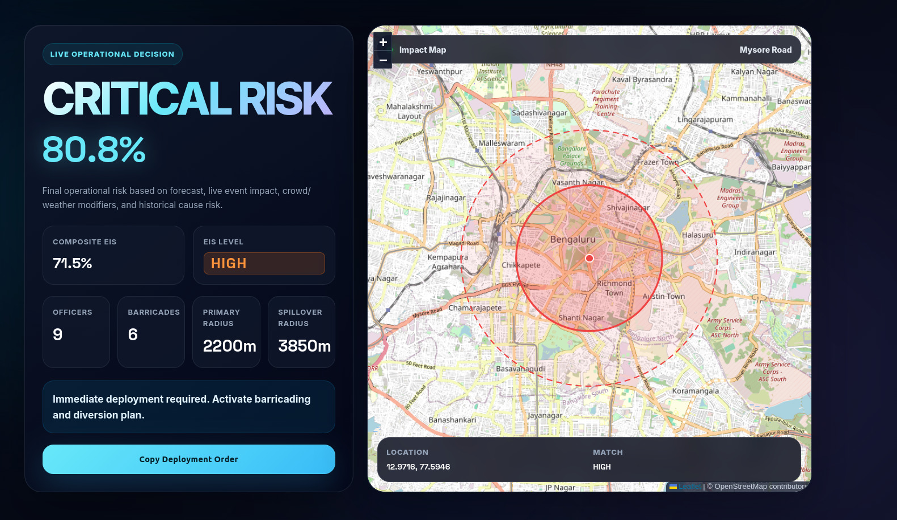
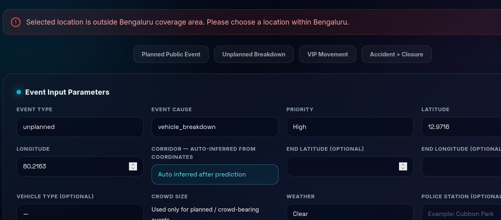

# Niyantrak: Coordinate-First Event-Driven Traffic Intelligence
 
> **Click a location on the map. Get a forecasted risk score, a quantified event impact, and a ready-to-deploy traffic order — in seconds, with the evidence to back every number.**
 
---
 
## The Problem
 
Traffic planning today is mostly reactive and experience-driven.
 
A planned event happens, traffic builds up, and someone on the ground makes a judgment call — usually without knowing in advance how bad it will actually get, and without ever recording whether that judgment turned out to be right.
 
| Problem | Reality |
|---|---|
| **Impact is never quantified in advance** | Officers and planners rely on instinct, not a comparable score, to size an event's traffic impact before it happens |
| **Corridor selection is a barrier** | Many tools require picking a known corridor by name — but real incidents happen between corridors, near junctions, or at locations with no name in the system |
| **No outcome trail** | Post-event outcomes (actual duration, actual resources used) are rarely captured anywhere, so nothing gets more accurate over time |
 
Niyantrak removes all three barriers.
 
---
 
## What Niyantrak Does
 
Niyantrak is a **coordinate-first traffic intelligence system**. A user clicks a location on the map and enters basic event details:
 
> _Accident, heavy vehicle, road closure, near ORR East 1, evening rush hour._
 
Niyantrak responds with:
 
- A forecasted incident risk, with an 80% prediction interval
- A 0–100 **Event Impact Score (EIS)** combining historical forecast, live event severity, crowd, and weather
- A final operational risk level (LOW / MODERATE / HIGH / CRITICAL)
- An affected-area map with primary and spillover impact circles
- Officer and barricade recommendations
- Primary and secondary diversion routes
- The nearest similar historical event, for grounding
- A fully validated, evidence-backed model — not a black box
No corridor names to memorize. No manual lookups. One map click and a short form.
 
---
 
## Target Users
 
- Traffic police and control-room operators planning resource deployment for known events
- City traffic planning teams assessing the likely impact of upcoming public events, processions, or construction
- Hackathon judges and technical reviewers evaluating the system's ML rigor and honesty about its own limitations
---
 
## Architecture — Coordinate-First Pipeline
 
Instead of requiring a known corridor name, Niyantrak resolves location intelligence directly from coordinates, then layers a two-tier ML forecast with rule-based operational logic on top:
 
```
        Event Location (lat, lng) + Event Details
                       │
                       ▼
┌───────────────────────────────────────────┐
│  Location Resolver                        │  Validates Bengaluru bounds, finds the
│                                            │  nearest corridor / cluster / hotspot.
└────────────────────┬────────────────────────┘
                     │  corridor, cluster_id, confidence
                     ▼
┌───────────────────────────────────────────┐
│  Coordinate-Aware Feature Store           │  Supplies lag, rolling, corridor,
│                                            │  zone, and cluster risk features.
└────────────────────┬────────────────────────┘
                     │  feature vector
                     ▼
┌───────────────────────────────────────────┐
│  Two-Tier Forecasting Layer                │  Primary: point-aware spatial-
│  (spatial model → corridor-hour fallback)  │  cluster CatBoost hurdle model.
│  Each tier: classifier + regressor +       │  Fallback: corridor-hour hurdle
│  quantile bounds                           │  model when spatial confidence is low.
└────────────────────┬────────────────────────┘
                     │  forecast risk + 80% interval
                     ▼
┌───────────────────────────────────────────┐
│  Event Impact Scoring (EIS)               │  Blends forecast risk with live event
│                                            │  severity, crowd, weather, cause risk.
└────────────────────┬────────────────────────┘
                     │  EIS score + level
                     ▼
┌───────────────────────────────────────────┐
│  Operational Layer                        │  Final risk, officers/barricades,
│  (resourcing + diversion + deployment)     │  diversion routes, deployment order.
└────────────────────┬────────────────────────┘
                     │
                     ▼
            Dashboard Output
   (risk · EIS · map · resources · diversion · order)
```
 
**Why coordinate-first?**
Earlier designs depended on the user picking a corridor name manually — weak, because real incidents happen between corridors, near service roads, or at locations with no entry in the system. The Location Resolver removes that dependency: it infers the nearest corridor, spatial cluster, and hotspot directly from coordinates, with a Bengaluru boundary check so out-of-city points are rejected rather than silently mismatched.
 
**Why a two-stage forecast model instead of one regressor?**
More than 90% of corridor-hours have zero incidents. A single regressor trained on that data collapses toward predicting near-zero everywhere and misses real spikes. Splitting the problem into "will anything happen" (classifier) and "how much, if so" (regressor) handles the sparsity directly — see [Forecasting Model](docs/forecasting-model.md).
 
**Why two forecasting tiers, not one model?**
Niyantrak runs this hurdle architecture twice — once on a **point-aware spatial-cluster model** (primary), and once on a **corridor-hour model** (fallback) — selecting whichever has higher location-resolution confidence for the given coordinates. The dashboard's "Forecast Source" field always tells you which one was used for a given prediction.
 
**Why is the KMeans cluster fallback only a fallback, not the default?**
Because an ablation study showed it underperforms normal corridor-hour history when corridor matching is reliable — see [Location Intelligence](docs/location-intelligence.md#cluster-fallback-ablation-study). It's used only when nothing better is available, not because it sounded good in theory.
 
### Final Operational Risk, Not Just a Forecast
 
Historical forecast risk can be LOW for a corridor while the live event itself is severe (accident + heavy vehicle + road closure). Niyantrak's final risk decision combines both, so a quiet corridor's history doesn't suppress a genuinely serious live event — see [Operational Outputs](docs/operational-outputs.md).
 
### Evidence, Not Assertions
 
Every non-obvious design choice in this system is backed by a test, not just claimed:
 
- The cluster fallback was validated with an ablation study, not assumed to help.
- The EIS weight formula was calibrated against historical outcomes using a severity proxy, not picked by intuition.
- Model metrics (including a modest R²) are reported honestly, with an explanation of why alert-level metrics (ROC-AUC ≈ 0.85) matter more for this rare-event problem.
See [Judge / Reviewer Notes](docs/judge-notes.md) for the full breakdown.
 
---
 
## Project Structure
 
```
NIYANTRAK/
├── config.py                       # Global configuration
├── train_all.py                    # Full training pipeline entry point
├── requirements.txt                # Python dependencies
│
├── scripts/
│   ├── predict.py                  # Terminal/CLI predictor
│   ├── prepare_feature_store.py    # Standalone feature store builder
│   ├── train_spatial_model.py      # Standalone spatial-model training/refresh
│   └── retrain_30_days.py          # Rolling-window retraining helper
│
├── src/
│   ├── preprocessing/
│   │   ├── load_data.py            # Data loading and cleaning
│   │   └── clean.py                # Additional cleaning utilities
│   │
│   ├── features/
│   │   ├── event_calender.py       # Calendar-aware event context features
│   │   └── feedback_training.py    # Feedback-derived training utilities
│   │
│   ├── forecasting/
│   │   ├── build_timeseries_dataset.py
│   │   ├── build_spatial_timeseries_dataset.py
│   │   ├── cross_validate_timeseries.py
│   │   ├── train_timeseries_model.py
│   │   ├── train_spatial_timeseries_model.py
│   │   ├── forecast_predictor.py
│   │   ├── spatial_forecast_predictor.py
│   │   ├── forecast_feature_importance.py
│   │   └── train_quantile_intervals.py
│   │
│   ├── inference/
│   │   ├── feature_store.py            # Coordinate-aware feature store
│   │   ├── location_resolver.py        # Coordinate → corridor/cluster resolution
│   │   ├── location_validity_guard.py  # Bengaluru bounds + restricted-zone checks
│   │   ├── police_station_resolver.py  # Nearest police station lookup
│   │   ├── active_event_memory.py      # In-session active event tracking
│   │   ├── predict_traffic_risk.py
│   │   └── similar_events.py           # Historical similar-event lookup
│   │
│   ├── scoring/
│   │   ├── event_impact.py         # Live Event Impact Score (EIS)
│   │   └── risk_score.py
│   │
│   ├── recommendation/
│   │   └── resource_recommender.py # Officer / barricade recommendation logic
│   │
│   ├── routing/
│   │   └── diversion_engine.py     # Corridor-graph diversion planning
│   │
│   └── evaluation/
│       ├── cluster_fallback_ablation.py
│       └── eis_weight_calibration.py
│
├── traffic_web/                    # Django project (settings, urls, wsgi, asgi)
│
├── dashboard/
│   ├── services/
│   │   ├── ml_engine.py
│   │   └── feedback_store.py
│   ├── templates/dashboard/
│   │   └── index.html
│   └── static/dashboard/
│       └── style.css
│
├── models/
│   ├── timeseries_forecast_model.pkl
│   ├── timeseries_forecast.pkl
│   ├── spatial_timeseries_forecast_model.pkl   # primary, point-aware spatial-cluster model
│   ├── traffic_feature_store.pkl
│   ├── cluster_fallback_ablation.json
│   └── eis_weight_calibration.json
│
├── data.csv                        # Raw event data
├── manage.py                       # Django management entry point
├── docs/                           # Full documentation (see table below)
└── README.md                       # This file
```
 
`traffic_web/` is the Django project package (settings, URLs, WSGI/ASGI entry points) that wraps the `dashboard` app shown above.
 
---
 
## Setup
 
### Prerequisites
 
- Python 3.10+
- pip
---
 
### Step 1 — Clone the repository
 
```bash
git clone https://github.com/adarsh-yadav1/Niyantrak.git
cd Niyantrak
```
 
---
 
### Step 2 — Install dependencies
 
```bash
pip install -r requirements.txt
```
 
> **Windows users:** `requirements.txt` includes Jupyter-related packages (`jupyter_server_terminals`, `terminado`) that depend on `pywinpty`. On Windows, `pywinpty` sometimes fails to resolve automatically through the bulk `requirements.txt` install and needs to be installed explicitly. If you hit an error related to `pywinpty` during or after Step 2, run:
>
> ```bash
> pip install pywinpty==3.0.3
> ```
>
> Then re-run `pip install -r requirements.txt` to pick up anything that failed to install before `pywinpty` was resolved. This step is **not needed on macOS or Linux** — `pywinpty` is a Windows-only package and pip will simply skip it on other platforms.
 
---
 
### Step 3 — Run the training pipeline
 
```bash
python train_all.py
```
 
This loads the data, builds the corridor-hour and spatial-cluster time-series datasets, trains the zero-inflated CatBoost hurdle models (both the primary spatial model and the corridor-hour fallback), builds the coordinate-aware feature store, runs the cluster fallback ablation, trains the quantile interval models, and runs EIS weight calibration — in one command. See [Setup & Usage](docs/setup-and-usage.md) for what each step generates.
 
---
 
### Step 4 — Run the dashboard
 
```bash
python manage.py runserver
```
 
Open the local server URL in your browser to use the map-based dashboard.
 
---
 
### Alternative — Run the terminal predictor
 
```bash
python scripts/predict.py
```
 
Useful for a quick CLI-based prediction without starting the web dashboard.
 
---
 
## Usage Examples
 
### ✅ Planned public event
 
```
Event: public event, mega crowd (60,000+), no road closure
Location: near Mysore Road, evening rush hour
```

Returns a HIGH-level EIS driven primarily by crowd size and rush-hour timing, with officer/barricade counts and a primary diversion route.
 
---
 
### ✅ Live accident with road closure
 
```
Event: accident, heavy vehicle, road closure required
Location: Shivaji Nagar, 09:12
```
 
Even if the historical forecast risk for that corridor-hour is LOW, the final operational risk escalates to HIGH because of the live event severity — see [Operational Outputs](docs/operational-outputs.md#final-operational-risk).



---
 
### ✅ Out-of-coverage coordinate
 
```
Latitude: 28.6139, Longitude: 77.2090   (Delhi, not Bengaluru)
```

The system rejects the input rather than force-matching it to a corridor:
 
```
Selected location is outside Bengaluru coverage area.
Please choose a location within Bengaluru.
```
 
---
 
## Tuning System Behavior
 
| File | What it controls |
|---|---|
| `src/scoring/event_impact.py` | Event cause, vehicle type, and rush-hour impact weights |
| `src/scoring/risk_score.py` | Forecast-to-risk-percentage conversion thresholds |
| `src/evaluation/eis_weight_calibration.py` | EIS formula weight search and severity proxy definition |
| `src/routing/diversion_engine.py` | Corridor graph and detour/support corridor mappings |
| `src/inference/feature_store.py` | What historical profiles are precomputed and stored |
| `src/inference/location_validity_guard.py` | Bengaluru bounding box and restricted-zone definitions |
| `config.py` | Global configuration (paths, Bengaluru bounding box, etc.) |
 
---
 
## Generated Model Artifacts
 
After running `train_all.py`:
 
```
models/timeseries_forecast_model.pkl
models/timeseries_forecast.pkl
models/spatial_timeseries_forecast_model.pkl
models/traffic_feature_store.pkl
models/cluster_fallback_ablation.json
models/eis_weight_calibration.json
EIS_WEIGHT_CALIBRATION.md
forecast_feature_importance.png
```
 
---
 
## Tech Stack
 
| Layer | Technology | Purpose |
|---|---|---|
| Backend language | Python | Core application and ML logic |
| Web framework | Django | Dashboard server and routing |
| Forecasting model (primary) | CatBoost (point-aware spatial-cluster hurdle model) | First-choice forecast when location confidence is high |
| Forecasting model (fallback) | CatBoost (corridor-hour hurdle model) | Used when spatial-cluster confidence is low |
| Spatial clustering | KMeans (scikit-learn) | Spatial cluster fallback for weak/unknown locations |
| Feature storage | Precomputed feature store (pickle) | Lag, rolling, corridor, zone, and cluster risk lookups |
| Map visualization | Leaflet / OpenStreetMap | Event marker, impact circles, diversion display |
| Data handling | Pandas | CSV ingestion, time-series aggregation |
 
---
 
## Features
 
| Feature | Description |
|---|---|
| Coordinate-first prediction | No manual corridor selection — click a point, get a resolved location |
| Bengaluru boundary validation | Out-of-coverage coordinates are rejected, not silently mismatched |
| Restricted-zone validation | Coordinates inside defined no-go/restricted zones are flagged separately from out-of-city rejections |
| KMeans spatial fallback | Ablation-tested fallback for locations with weak corridor matches |
| Two-tier forecasting | Point-aware spatial-cluster model (primary) with corridor-hour fallback (secondary) |
| Zero-inflated hurdle forecasting | Two-stage classifier + regressor built for a >90%-zero target distribution |
| 80% prediction interval | CatBoost quantile models, gated by alert probability |
| Calibrated Event Impact Score | 0–100 score combining forecast, live severity, crowd, weather, and cause risk |
| Final operational risk | Forecast + EIS combined so live severity isn't masked by quiet history |
| Resource recommendation | Officer and barricade counts scaled to risk level |
| Diversion planning | Primary/secondary detours and support corridors from a corridor graph |
| Similar historical events | Grounds new predictions in real past incidents |
| Post-event feedback collection | Stores actual outcomes for audit and future retraining |
| Model validation on dashboard | Metrics, ablation results, and EIS calibration evidence shown directly to the user |
 
---
 
## Limitations
 
- **No live traffic feed** — forecasts are historical-pattern-based plus user-entered live event details, not live road-speed data.
- **No automatic alerting** — deployment orders are generated and displayed, not sent automatically to officers.
- **Feedback is not yet retraining** — post-event outcomes are stored for audit, not looped back into the model automatically.
- **Diversion is corridor-graph based** — not live, dynamically-routed road-network routing.
- **Weather and crowd size are manual inputs** — no live weather API or crowd-sensing integration yet.
Full detail and reasoning in [Limitations & Roadmap](docs/limitations-and-roadmap.md).
 
---
 
## Future Improvements
 
- Integrate live traffic speed and weather feeds
- Send automatic deployment alerts to officers
- Use an OpenStreetMap road graph for dynamic diversions
- Use officer feedback for scheduled (not automatic) retraining
- Add model drift monitoring and an MLflow model registry
- Add real-time congestion heatmap and CCTV/GPS/sensor integration
---
 
## Documentation
 
This README covers the essentials. Full documentation — including the complete pipeline rationale, every feature definition, and reviewer-facing evidence — lives in [`docs/`](docs/):
 
| Doc | Covers |
|---|---|
| [Architecture](docs/architecture.md) | End-to-end pipeline, coordinate-first design rationale, ML vs. statistical vs. rule-based breakdown, project structure |
| [Data & Features](docs/data-and-features.md) | Raw dataset, corridor-hour time-series generation, lag/rolling/spatial risk features |
| [Forecasting Model](docs/forecasting-model.md) | Zero-inflated CatBoost hurdle model, quantile prediction intervals, model metrics, R² explanation |
| [Location Intelligence](docs/location-intelligence.md) | Feature store, location resolver, Bengaluru bounds validation, KMeans cluster fallback + ablation study |
| [Event Impact Scoring](docs/event-impact-scoring.md) | Event Impact Score (EIS) formula, crowd/weather multipliers, EIS weight calibration |
| [Operational Outputs](docs/operational-outputs.md) | Final operational risk, resource recommendation, diversion engine, deployment order |
| [Dashboard](docs/dashboard.md) | What the dashboard displays, map visualization, similar historical events |
| [Feedback & Retraining](docs/feedback-and-retraining.md) | Post-event feedback collection, current scope vs. future retraining |
| [Setup & Usage](docs/setup-and-usage.md) | Installation, training pipeline, running the dashboard and CLI predictor |
| [Limitations & Roadmap](docs/limitations-and-roadmap.md) | Known limitations and planned improvements |
| [Judge / Reviewer Notes](docs/judge-notes.md) | Honest, evidence-based explanations for hackathon/evaluation reviewers |
 
---
 
## One-Line Summary
 
```
Map coordinates → location intelligence → two-tier hurdle forecast → calibrated EIS → final operational risk → impact map → deployment and diversion recommendation
```
 
---
 
## License
 
Not yet specified by the author.
